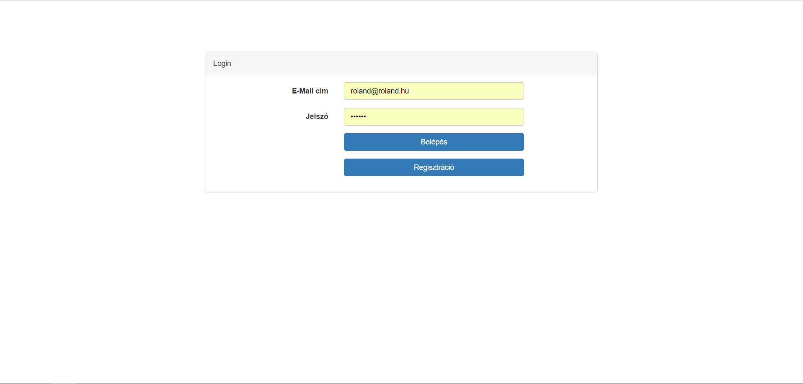

# Dokumentáció
##Családi Todo
Aradi Roland - VDK4HH

###1.	Célkitűzés
A családomnak rengeteg dolga van egy nap leforgása alatt amiket el kell végezniük, viszont a mennyisége ezeknek a feladatoknak 
ellehetetleníti a céltudatos és hatékony megoldásukat. Ezen applikáció segítségével összegyűjteni, rendszerezni tudják ezeket a 
feladatokat, hogy később távolról bármikor elérhessék őket.

######Funkcionális követelmények:
* Regisztráció
* Bejelentkezés
* Csak bejelentkezett felhasználók által elérhető funkciók
  - új todo létrehozása
  - todo szerkesztése
  - todo törlése
  - todo teljesítetté tevése
  - todo megosztása más családtaggal

######Nem funkcionális követelmények:
*	**Könnyű áttekinthetőség:** Szín szerinti csoportosítás: fontos és kevésbé fontos feladatok, illetve teljesített feladatok megkülönböztetésére
*	**Használhatóság:** Ésszerű elrendezés, egyszerű használhatóság, "nagymama proof" design
*	**Megbízhatóság:** Jelszóval levédett, regisztráció alapú program, felhasználók nem láthatják más felhasználók todo-it, kivéve ha meg van osztva vele

__Használati esetek:__

# 2. Tervezés

### Oldaltérkép

__publikus:__

- bejelentkezés
- regisztráció

__bejelentkezett:__

- teendők
  - új teendő
  - teendők listázása
    - teendő szerkesztése
    - teendő törlése

### Design-tervek végső megvalósítása
Belépés

Regisztráció

Főoldal

Főoldal-animáció

Új teendő

Elvégzett teendők

### Adatbázis kapcsolatok

## 4. Tesztelés
Szerver oldali tesztelés:
- Regisztráció: -> A program leellenőrzi, hogy már regisztráltak-e ugyan azzal az e-mail címmel, amivel éppen regisztrálni próbálunk.
Kliens oldali tesztelés:
- Új task: -> Hibás adatok megadásánál ezt jelzi a program.
- Task módosítása: -> Hibás adatok megadásánál ezt jelzi a program.
- Regisztráció: -> Hibás adatok megadásánál ezt jelzi a program.
- Bejelentkezés: -> Hibás adatok megadásánál ezt jelzi a program.

## 5. Felhasználói dokumentáció

**Futtatáshoz szükséges operációs rendszer:** Tetszőleges operációs rendszer

**A futtatáshoz szükséges hardver:** Operációs rendszerek szerint megadva

**Egyéb követelmények:** Internet böngésző telepítése, JavaScript ajánlott

**Program használata:**

1. Böngészőben nyissuk meg a főoldalt
2. Bejelentkezés/Regisztráció feliratra kattintva eldönthetjük mit szeretnénk tenni
3. Bejelentkezés után a főoldalra jutunk
4. Az új teendő gombra kattintva új taskot hozhatunk létre. JavaScript mentes környezetben a program átirányít minket egy másik oldalra, ahol be tudjuk fejezni a teendő hozzáadását, egyébként egy modal ablak ugrik fel, amiben ki tudjuk tölteni a mezőket. (AJAX segítségével tölti be)
5. Töltsük ki az űrlapot
6. Hibás adatok esetén az űrlap jelezni fogja a hibát
7. Mentés gombra kattintva mentsük el az adatokat
8. Task törlése gomb (piros kuka jel): A kiválasztott taskot törölhetjük
9. Task szerkesztése (ceruza jel): A kiválasztott taskot szerkeszthetjük
10. Task elvégzése (zöld pipa): A kiválasztott teendőt elvégzetté tehetjük
11. Elvégzett teendők menüpont: Megtekinthetjük az elvégzett teendőket 
12. Logout menüpont: Kijelentkezhetünk a programból
